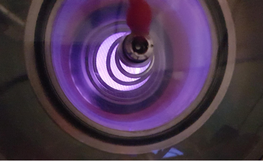

# EM Cavity
This repository contains all the software needed to run the EM Cavity experiment.
## FREE Server
The `cavity_FREE_serve` folder contains all the HTML and JS needed to host the experiment page. 

It also contains the image of the experiment to be uploaded to the FREE server in the apparatus table of the experiment in the folder `Imagem` (named `cavity.png`).

## RPi_Proxy
The `RPi_Proxy` folder contains the proxy tool that can run the experiment and communicate with a 0.6.0 version of the FREE server.

It is present the modification of the EM Cavity code and the `RPi_Proxy/pic_interface/interface.py` so that the proxy is able to execute the state machine of the experiment and send the data to the FREE server.

## EM Cavity Code
The `EM_Cavity` folder has all the software developed in the master thesis [**Deployment of a microwave cavity experiment using the Framework for Remote Experiments in Education**](https://fenix.tecnico.ulisboa.pt/cursos/meft21/dissertacao/1128253548923088).

Including the test of individual software written for the pressure reader and the spectrum analyser.

    

